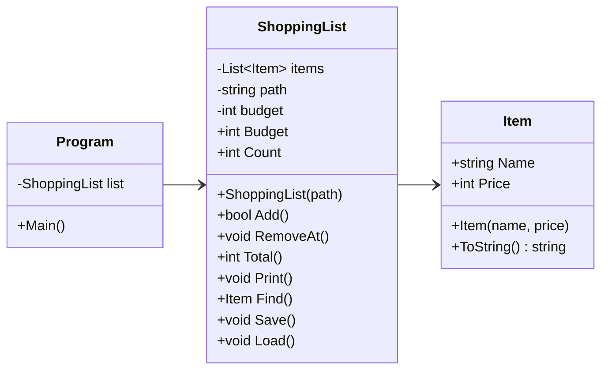

# Felrapport

## Fel 1
items.txt hade en tom rad så att hela programmet kraschade. Först kollade jag var i koden som felmeddelandet pekade på.
Men sen förstod jag felet och tog bort raden och då kunde jag köra programmet. Sen kraschade programmet om man sparade.
Då fick jag ändra så att Load använder File.ReadAllLines istället för File.ReadAllText som läser all text istället för rad för rad. Samt tog bort text.Split... som gjorde att radbrytningarna gav en tom rad.
Detta gjorde också att titlarna på alla varor syntes.

## Fel 2
choice behöver vara en TryParse med bool så att programmet inte kraschar om man skriver in bokstav vid menyval.

## Fel 3
Även number behöver vara en TryParse med bool för att inte programmet ska krascha om man skriver in bokstav. Samt ett villkor som kollar att numret är mellan 1 och antalet varor i listan.

## Fel 4
Samt price behövde TryParse för att felhantera om inmatningen var bokstäver. price <= 0 lades till för att inte man ska kunna mata in 0 eller mindre.

## Fel 5
Ändrad for-loopen så den börjar på 0 istället för 1 i ShoppingList.cs under Total() så att alla varor på listan räknades med i totalpriset

## Fel 6
Fixade Program.cs, så att inte programmet kraschade om items.txt saknades. Använde try/catch så om listan fanns så laddades den, annars fick man felmeddelande att den inte kunde läsas.

## Fel 7
Ändrade i ShoppingList.cs genom att flytta in "Listan är sparad." i try och att det blev felmeddelande om det inte listan kunde sparas (skrivskyddad).
Innan om sparandet misslyckades så fick användaren aldrig reda på det.

 
 

# Del 2

## Designval
Add-metoden i ShoppingList.cs räknar ut om varan adderat med befintliga varor är mindre än budget.

Om den är över budget skickas den till Program.cs bool added som har en if-sats som berättar att man är över budget.
Annars läggs varan till.

Jag valde bool då koden blir mindre och jag förstår det och if-satser bäst. Samt att detta är inget riktigt fel, varan är giltig men den får inte plats just nu.

Samma inmatning med en lista med färre varor, så hade det varit rätt. Men även att programmet inte kraschar om varan gör så att användaren går över budget. Utan programmet körs vidare ändå. 

Om jag hade använt throw hade jag behövt ett try/catch block för att inte programmet skulle krascha.

