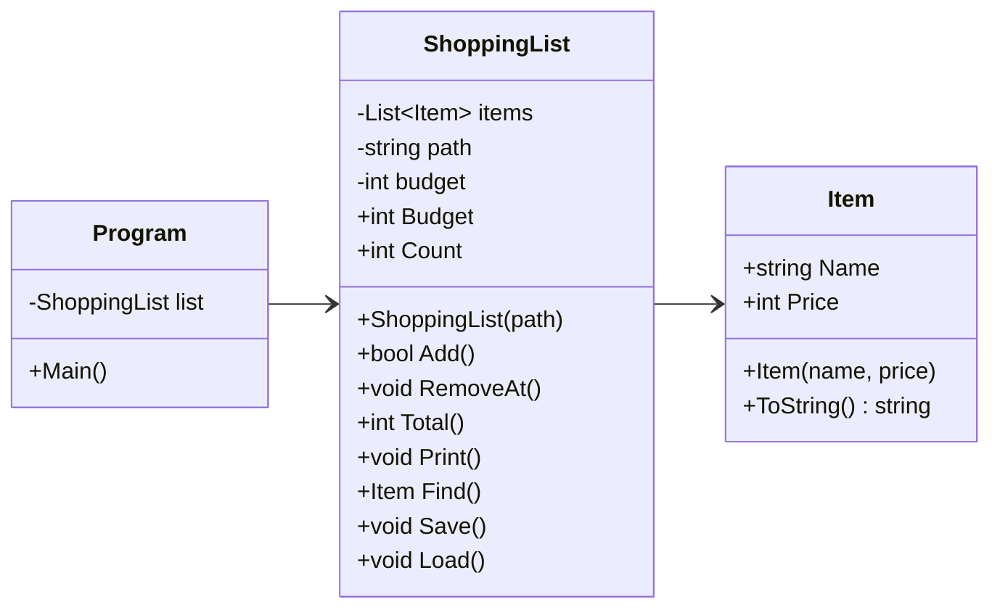

# Felrapport

## Fel – Tom rad i Load
1. Starta programmet
2. Programmet kraschar direkt

   at ShoppingList.Load() in C:\Users\nicla\Downloads\kk2-startkod-main\kk2-startkod-main\ShoppingList.cs:line 90
   at Program.<Main>$(String[] args) in C:\Users\nicla\Downloads\kk2-startkod-main\kk2-startkod-main\Program.cs:line 2

### Åtgärd
Den tomma raden i slutet gjorde att det kraschade,  för price var int.Parse som inte kan ta emot tom sträng.
Tog bort tom rad i slutet på items.txt som tog bort problemet tillfälligt så jag kunde köra programmet.
Därefter så läggde jag till en kontroll i Load() i ShoppingList.cs som hoppar över tomma rader.

    if (string.IsNullOrWhiteSpace(line)) continue;

Så nu om mot förmodan en tom rad kommer int så kraschar inte programmet

## Fel - Programmet kraschar vid start efter att man har sparat
1. Starta programmet
2. Lägg till vara
3. Ange ett namn i bokstäver och ett pris i heltal
4. Spara
5. Avsluta programmet
6. Starta programmet igen
7. Programmet kraschar

   at ShoppingList.Load() in C:\Users\nicla\Downloads\kk2-startkod-main\kk2-startkod-main\ShoppingList.cs:line 90
   at Program.<Main>$(String[] args) in C:\Users\nicla\Downloads\kk2-startkod-main\kk2-startkod-main\Program.cs:line 2

### Åtgärd
ShoppingList.cs rad 89-90
        string text = File.ReadAllText(path);
        string[] lines = text.Split('\n');

Load() läste in filen som en text i stället för rader. Därför behövdes split innan för att det skulle bli rader.
Save skrev en radbrytning efter varje rad, även den sista.
Efter sista radbrytningen blev det en tom rad, och int.Parse kraschade på den (samma som Fel 1).

Byttes till
        string[] lines = File.ReadAllLines(path);

ReadAllLines delar själv upp så att varje inmatning pris;namn blir en rad och då inte tar med en tom rad som stökar till det.

## Fel - Första varans titel syns inte i varukorgen
1. Starta programmet
2. Varukorgen visas med namn och pris för alla varor förutom första som visar bara pris och tom titel.

### Åtgärd
Det blev två flugor i en smäll. Detta löstes när jag ändrade ReadAllText till ReadAllLines och tog bort text.Split i ShoppingList.cs (se föregående fel).

## Fel - Totalsumman blir fel
1. Starta programmet
2. Lägg till vara
3. Ange korrekt inmatning för namn och pris
4. Upprepa 4 gånger
5. Räkna ihop priserna manuellt i kalkylatorn och jämför med totalsumman i programmet
6. Totalsumman är för låg för att första varans pris räknas inte med

### Åtgärd
for-loopen hade fel startnummer (1), så första varan räknades inte med. I en lista så är första inmatningen 0.

        for (int i = 1; i < items.Count; i++)
Byttes till
        for (int i = 0; i < items.Count; i++)

## Fel – Menykrasch vid tom inmatning och bokstäver
1. Starta programmet
2. Skriv in en bokstav och tryck enter
3. Programmet kraschar

1. Starta programmet
2. Tryck enter
3. Programmet kraschar

   Unhandled exception. System.FormatException: The input string 'm' was not in a correct format.
   at System.Number.ThrowFormatException[TChar](ReadOnlySpan`1 value)
   at System.Int32.Parse(String s)
   at Program.<Main>$(String[] args) in C:\Users\nicla\Downloads\kk2-startkod-main\kk2-startkod-main\Program.cs:line 16

### Åtgärd
choice (menyval) i Program.cs rad 16 var en int.Parse, som kraschar om inmatningen inte är ett heltal.

Byttes till
        int.TryParse(Console.ReadLine(), out int choice);

TryParse kraschar inte om inmatningen är en bokstav eller tom blir choice 0. Inget menyval har nummer 0, så menyn visas igen och användaren får försöka på nytt.

## Fel - Lägga till vara utan pris innebär krasch
1. Starta programmet
2. Välj lägg till vara
3. Skriv valfritt namn, tryck enter, sen tryck enter igen.
4. Programmet kraschar

### Åtgärd
I Program.cs så deklareras pris med int.Parse. Precis som i föregående fel så kraschade det vid felaktiga inmatningar.
Byttes till !int.TryParse så om inmatningen inte är ett heltal visas ett felmeddelande och continue skickar användaren tillbaka till menyn.

       if (!int.TryParse(Console.ReadLine(), out int price))
        {
            Console.WriteLine("Felaktig inmatning. Det måste vara ett heltal");
            Console.ReadLine();
            continue;
        }

## Fel – Ta bort vara med bokstäver eller tom inmatning
1. Starta programmet
2. Välj ta bort vara
3. Skriv en bokstav istället för en siffra, eller tryck bara enter
4. Programmet kraschar

   Unhandled exception. System.FormatException: The input string 'a' was not in a correct format.
   at System.Int32.Parse(String s)

### Åtgärd
Programmet kraschade om man skrev in en bokstav istället för en siffra när man skulle ta bort en vara. Felet var att numret lästes in med int.Parse, som kraschar om det inte är en siffra.

number behövde läsas in av TryParse så att programmet inte kraschar om man skriver in bokstäver eller tom inmatning.

        int.TryParse(Console.ReadLine(), out int number);

        int index = number - 1;

        if (index < 0 || index >= list.Count)
        {
            Console.WriteLine("Ogiltigt nummer. Tryck enter för att komma till menyn");
            Console.ReadLine();
            continue;
        }

## Fel – Ta bort vara med ett nummer som inte finns
1. Starta programmet
2. Välj ta bort vara
3. Skriv 0, ett negativt tal eller ett högre nummer än antal varor
4. Programmet kraschar

   Unhandled exception. System.ArgumentOutOfRangeException: Index was out of range.

### Åtgärd
RemoveAt kollade aldrig om numret fanns i listan. Löstes med samma if-sats som i föregående fel.

        if (index < 0 || index >= list.Count)  

## Fel – Programmet kraschar om items.txt saknas
1. Ta bort eller byt namn på items.txt
2. Starta programmet
3. Programmet kraschar direkt

   Unhandled exception. System.IO.FileNotFoundException: Could not find file 'items.txt'.

### Åtgärd
Load försökte läsa filen även om den inte fanns. Lade Load i en try/catch i Program.cs.

        try
        {
            list.Load();
        }
        catch (FileNotFoundException ex)
        {
            Console.WriteLine($"Filen kunde inte hittas: {ex.FileName}");
        }

Programmet startar då med en tom lista istället för att krascha.

## Fel – Sparandet misslyckas utan att man får veta det
1. Högerklicka på items.txt, välj Egenskaper och kryssa i Skrivskyddad
2. Starta programmet
3. Välj spara
4. Programmet skriver "Listan är sparad." men inget sparas

### Åtgärd
Catch i Save() i ShoppingList.cs var tom, så felet syntes inte. "Listan är sparad." låg utanför try och visades även när det misslyckades.

Flyttade in "Listan är sparad." i try och lade till ett felmeddelande i catch.

        try
        {
            File.WriteAllText(path, string.Join("\r\n", lines) + "\r\n");
            Console.WriteLine("Listan är sparad.");
        }
        catch (UnauthorizedAccessException)
        {
            Console.WriteLine("Kunde inte spara listan.");
        }

 
 

# Del 2

## Designval
Add-metoden i ShoppingList.cs räknar ut om varan får plats i budgeten.
Om den inte får plats returnerar Add false och Program.cs visar ett felmeddelande med hur stor budgeten är. Annars läggs varan till.

            if (!list.Add(new Item(name, price)))
            {
               Console.WriteLine($"Din budget är: {list.Budget}. Varan du försökte lägga till har inte lagts till, för då är du över budget");
               Console.ReadLine();
            }

Jag valde bool då koden blir mindre och jag förstår det och if-satser bäst. Samt att detta är inget riktigt fel, varan är giltig men den får inte plats just nu. Programmet kraschar inte utan körs vidare ändå. Om jag hade använt throw hade jag behövt ett try/catch block för att inte programmet skulle krascha.

