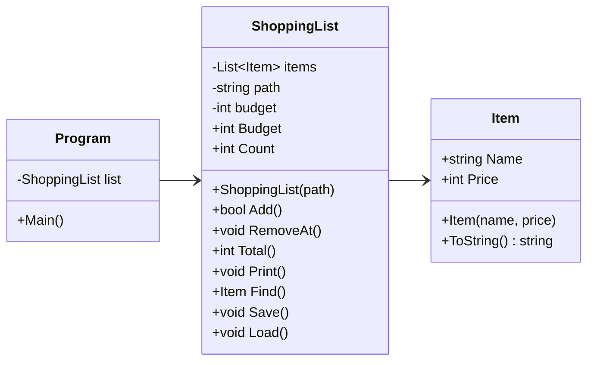

# Felrapport

## Fel 1 – Tom rad i Load
Programmet kraschade när det startade. Först kollade jag var i koden som felmeddelandet pekade på. Det såg ut som att items.txt hade en tom rad, så jag tog bort den och då kunde jag köra programmet. Men sen kraschade programmet igen när man sparade och startade om.

Då förstod jag att felet låg i koden och inte i filen. Load använde File.ReadAllText och text.Split('\n'), och det gjorde att radbrytningen i slutet av filen blev en tom rad.

Jag ändrade så att Load använder File.ReadAllLines istället, som läser rad för rad, och tog bort text.Split. Detta gjorde också att titlarna på alla varor syntes och att sökningen hittade dem, för innan låg det kvar ett \r i slutet av varje namn.

## Fel 2 – Bokstäver i menyn, priset eller numret
Programmet kraschade om man skrev in en bokstav istället för en siffra. Det gällde menyvalet, priset och numret när man tar bort en vara. Felet var att alla tre använde int.Parse, som kraschar om det inte är en siffra.

price och number behöver vara en TryParse med bool så att programmet inte kraschar om man skriver in bokstäver. Om det inte är en siffra får man ett felmeddelande istället. För choice (menyval) räckte det med en int.TryParse och där visades inget felmeddelande utan användaren får en ny chans att mata in en annan siffra.

## Fel 3 – Ta bort ett nummer som inte finns
Programmet kraschade om man skrev ett nummer som inte fanns i listan när man skulle ta bort en vara, t.ex. 0, ett negativt tal eller ett högre nummer än antal varor som finns. Felet var att RemoveAt aldrig kollade om numret fanns.

Jag lade till ett villkor som kollar att numret är mellan 1 och antalet varor i listan. Om det inte är så, får man ett felmeddelande istället.

## Fel 4 – Om items.txt saknas
Programmet kraschade direkt när det startade om items.txt inte fanns. Felet var att Load försökte läsa filen ändå, och då blev det undantaget FileNotFoundException.

Jag fixade Program.cs så att Load ligger i en try/catch. Om filen finns så laddas listan, annars får man ett felmeddelande att filen inte kunde hittas. Programmet startar då med en tom lista istället för att krascha.

## Fel 5 – Totalsumman blev fel
Totalpriset blev fel för första varan på listan räknades inte med. Det var för att for-loopen började på 1, men listan börjar på 0.
Ändrade for-loopen så den börjar på 0 istället för 1 i ShoppingList.cs under Total() så att alla varor på listan räknades med i totalpriset.

## Fel 6 – Sparandet misslyckades utan att man fick veta det
Ändrade i ShoppingList.cs genom att flytta in "Listan är sparad." i try och att det blev felmeddelande om listan inte kunde sparas (skrivskyddad).
Innan om sparandet misslyckades så fick användaren aldrig reda på det. Catch var tom så felet syntes inte.

 
 

# Del 2

## Designval
Add-metoden i ShoppingList.cs räknar ut hur mycket som är kvar av budgeten om varan skulle läggas till.

Om den är över budget skickas den till Program.cs bool added som har en if-sats som berättar att man är över budget.
Annars läggs varan till.

Jag valde bool då koden blir mindre och jag förstår det och if-satser bäst. Samt att detta är inget riktigt fel, varan är giltig men den får inte plats just nu.

Samma inmatning med en lista med färre varor, så hade det varit rätt. Men även att programmet inte kraschar om varan gör så att användaren går över budget. Utan programmet körs vidare ändå. 

Om jag hade använt throw hade jag behövt ett try/catch block för att inte programmet skulle krascha.

